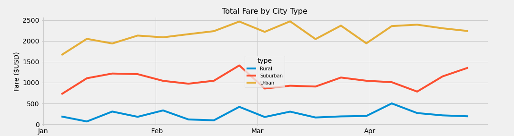

# PyBer_Analysis

## Project Overview
PyBer, the ride-sharing company, has given data on their ride-sharing fares to find performance trends and analysis per city type.

1. Calculate the total number of rides and drivers.
2. Get the total fare amount per city type.
3. Calculate the average fare per ride and per driver.

## Resources
- Data Source: city_data.csv, ride_data.csv
- Softwar: Python 3.7.6, Visual Studio Code, 1.52.1

## Results
The analysis of the ride-sharing fares from 01-01-2019 to 05-08-2019 show that:
- There were 2,375 total rides.
    - Majority coming from urban city types with 1,625 rides.
- The total number of drivers were 2,973.
    - Majority from urban city types with 2,405 drivers.
- All fares during time period totaled $63,538.64.
    - With urban city types having the highest total with $39,854.38.
- Averages:
    - Rural city types showed the hightest averages for both per ride and per driver with $34.62 and $55.49, respectively.       

## Challenge Summary  

The figure shows that urban city types have dominated the other city types through first quarter of the 2019 year.
- This disparity between the city types can account for the population size in higher densed cities and therefore would have more riders and available drivers.
- Urban city types tend to utilize ride-sharing more for convience and like to avoid hassles such as parking and vehicle maintenance.
- People living in rural city types would most likely need their own vehicle to travel, work, and tackle errands which would lean towards little use for ride-sharing.
